# HubSpot CRM Build: Turning Pipeline Analysis into Guardrails

**I analysed a B2B CRM and found the pipeline couldn't be trusted. Then I rebuilt the CRM so the same problems can't happen again.**

[📊 The analysis that started this](https://github.com/murilotoledo44-hub/b2b-sales-pipeline-analysis) · [🌐 Portfolio](https://murilotoledo44-hub.github.io) · [💼 LinkedIn](https://www.linkedin.com/in/murilo-toledoremote)

---

## The problem

My [pipeline analysis](https://github.com/murilotoledo44-hub/b2b-sales-pipeline-analysis) of ~8,800 B2B opportunities found three problems that no report can fix, because they start at data entry:

| Finding | What it cost | Guardrail I built |
|---|---|---|
| 92% of in-progress deals had been open 90+ days — twice the 45-day median cycle | The forecast counted deals that were never going to close | Stage exit criteria, a required next step, and an automated stale-deal flag |
| Product names (`GTXPro` vs `GTX Pro`) and industry labels (`technolgy`) were inconsistent | Joins broke and reports silently under-counted | Dropdown properties replacing free text |
| No structured reason for any lost deal | Lost-deal reviews and coaching had nothing to work with | A required, standardized lost reason |

**Goal:** a pipeline a sales leader can forecast from, and data clean enough to report on without manual fixes.

## What I built

A working CRM in HubSpot (Sales Hub Enterprise, developer test account), loaded with 497 deals and 85 companies from the same dataset I analysed.

### 1. Pipeline with exit criteria

Seven stages, each with a defined exit criterion and a win probability.

| Stage | Probability | Exits when |
|---|---|---|
| Prospecting | 5% | A first meeting is booked |
| Discovery | 15% | Pain, budget range and decision maker confirmed |
| Solution Fit | 35% | Product fit validated, buyer agrees to a proposal |
| Proposal Sent | 60% | Buyer engages on terms or pricing |
| Negotiation | 80% | Contract signed, or deal lost |
| Closed Won / Closed Lost | 100% / 0% | — |

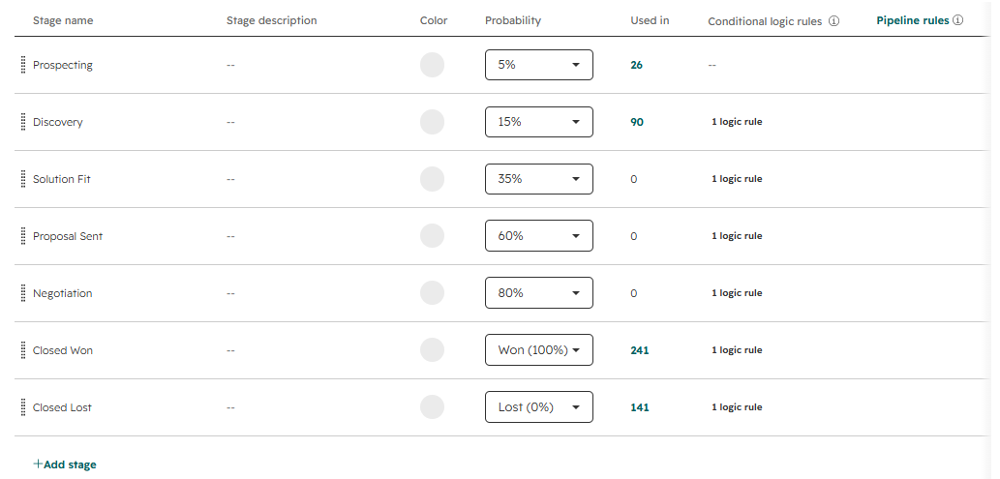

### 2. Required properties that grow with the deal

Prospecting requires nothing — reps shouldn't be slowed down while prospecting. Every stage after it requires the fields that protect the forecast.

| Moving into | Required |
|---|---|
| Discovery | Product, Deal source, Next step, Next step date |
| Solution Fit | Amount, Close date, Decision maker identified |
| Proposal Sent | Proposal sent date |
| Negotiation | Discount %, Next step, Next step date |
| Closed Won | Amount, Close date |
| Closed Lost | Lost reason |

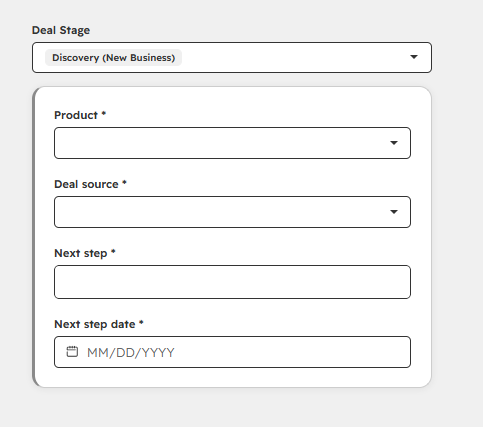

**The rule in action.** HubSpot blocks the stage change until the fields are filled — the Save button stays disabled:

| Moving to Discovery | Closing a deal as lost |
|---|---|
| 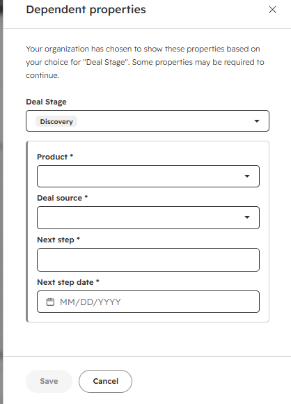 | 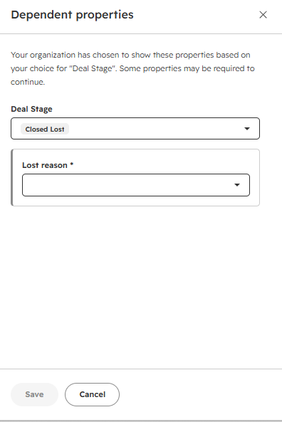 |

### 3. Five workflows

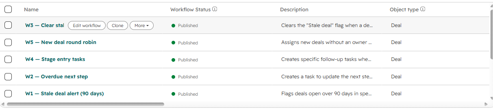

| # | Workflow | Trigger | What it does |
|---|---|---|---|
| W1 | Stale deal alert (90 days) | Open deal created more than 90 days ago | Flags the deal, tasks the owner to advance or close it, notifies the manager |
| W2 | Overdue next step | Next step date is in the past | Tasks the owner to set a real next step |
| W3 | Clear stale flag | Flagged deal reaches a later stage | Removes the flag so the report stays honest |
| W4 | Stage entry tasks | Deal enters Discovery, Proposal Sent or Negotiation | Creates the right follow-up task for that stage |
| W5 | New deal round robin | Deal created with no owner | Rotates ownership so no deal sits unassigned |

**Why 90 days:** twice the 45-day median sales cycle measured in the analysis. The threshold comes from the data, not from a hunch.

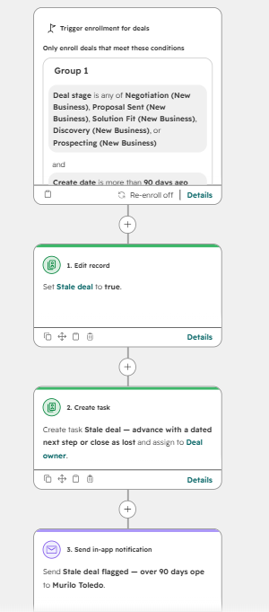

W4 branches by stage so each one gets a different task and due date:

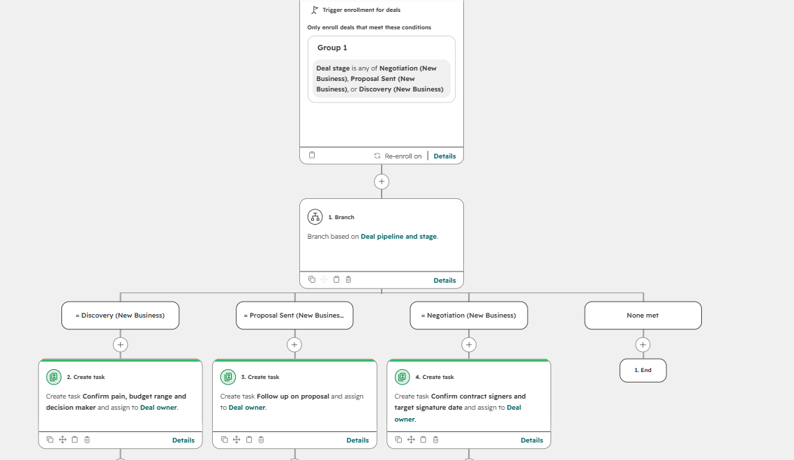

### 4. Data import

497 deals and 85 companies, cleaned with the same fixes as the analysis (`GTXPro` → `GTX Pro`, `technolgy` → `technology`) so every value matched a dropdown option on arrival. 421 deal-company associations, one rejected row.

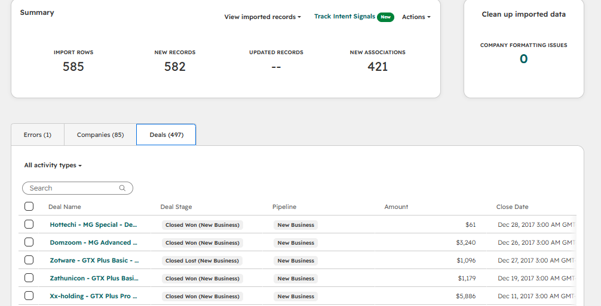

### 5. Pipeline Health dashboard

Seven reports: deals and value by stage, won revenue by quarter, lost reasons, average discount by product, and stale deals by owner.

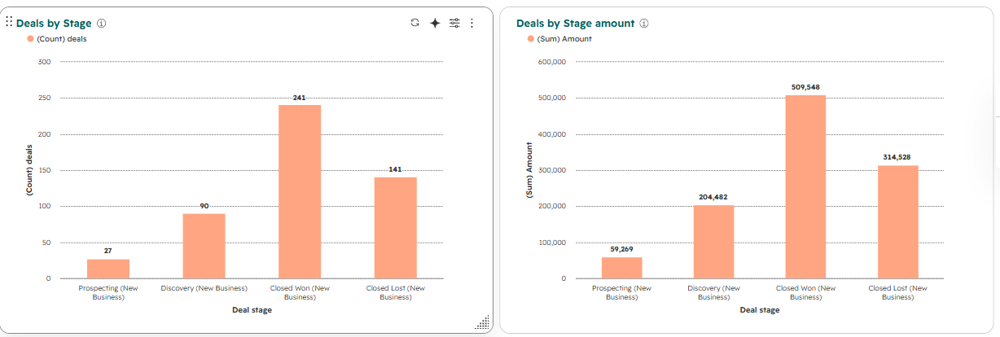
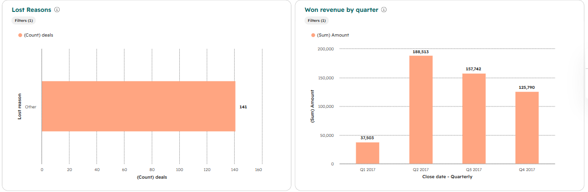
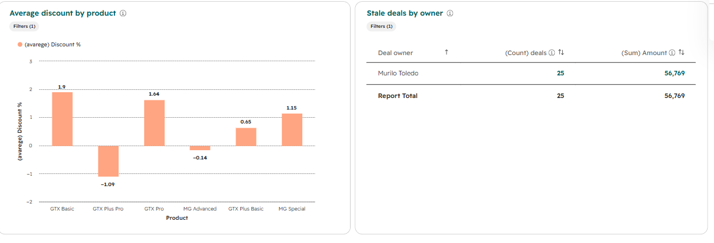

## What the guardrails surfaced

**Stale pipeline is real and measurable.** Once W1 ran, it flagged **25 deals holding $56,769 of pipeline** that had been open past 90 days with no close date. In a weekly review that table is the agenda: each deal gets a dated next step or gets closed.

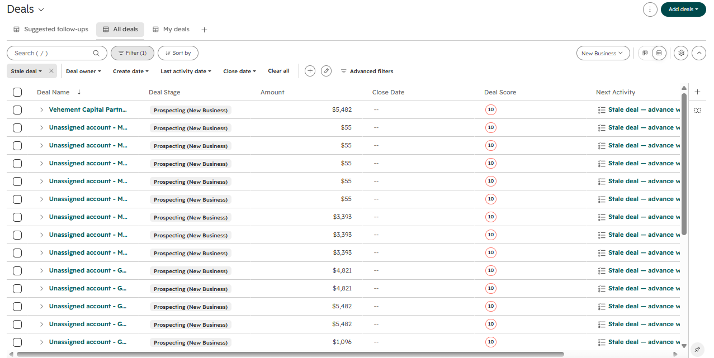

**100% of lost deals had no reason recorded.** Every imported lost deal came in as `Other — reason not recorded in the legacy system`, because the source system never captured one. That single bar is the argument for the new required field.

**Pricing discipline was never the problem.** Average discount by product ranges from **-1.1% to +1.9%** of list price — deals close essentially at list, with over- and under-list closes cancelling out. So I did *not* add a discount-approval step: it would add friction to a process that isn't broken. Monitoring it as a KPI is enough.

## What I'd do differently, and what the environment limited

Honest notes, because a build is never as clean as a spec:

- **A workflow that cancelled itself.** W3 (clear the stale flag) originally triggered on "deal stage is any of…", which every open deal matches permanently — so W1 flagged deals and W3 immediately unflagged them. I spotted it because only one stage survived the flagging, and fixed it by narrowing W3 to later stages. HubSpot has no "stage has changed" filter operator in this trigger type, so the fix is a workaround rather than the ideal rule.
- **Workflows don't enroll records that are born matching the filter.** The imported deals were already 90+ days old, so nothing "changed" for W1 to react to. Retroactive enrollment was needed once — standard practice when a new rule goes live on existing data.
- **Deal source came in blank.** The legacy dataset has no source field. Rather than invent one, I left it empty: it's a visible reminder that historic data doesn't meet the new standard, and the requirement only binds deals moving forward.
- **Single-user environment.** The test account has one user, so round-robin assignment and the stale-deals-by-owner report all resolve to the same person. In a real team, that report is the weekly pipeline review, with each rep answering for their own list.
- **Notifications go to a fixed user, not the deal owner.** HubSpot's in-app notification action doesn't accept a dynamic owner; the task created by the same workflow does, so the rep is still notified.

## Repository

```
├── README.md
├── hubspot-crm-spec.md        # the design spec, written before the build
├── prepare_import.py          # dataset → HubSpot-ready CSVs
└── screenshots/
```

## Tools

HubSpot (pipelines, custom properties, conditional stage properties, workflows, custom reports, imports) · Python + pandas for the data preparation

---

*Murilo Toledo — moving from outbound sales into Revenue Operations.*
